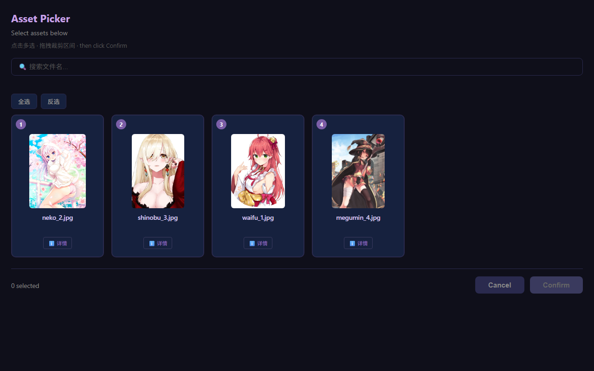
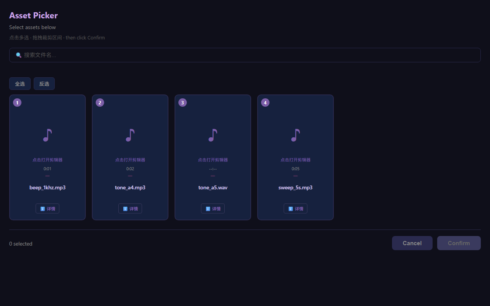
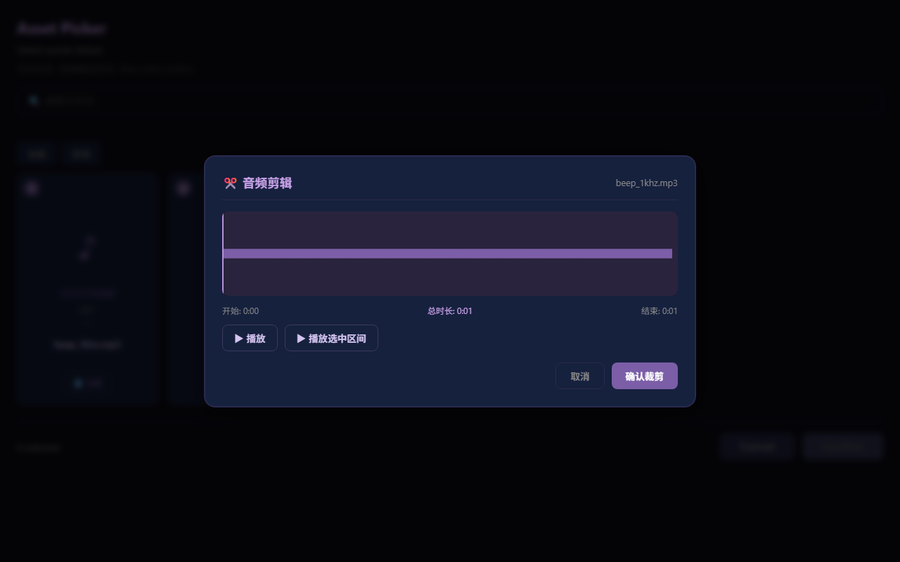
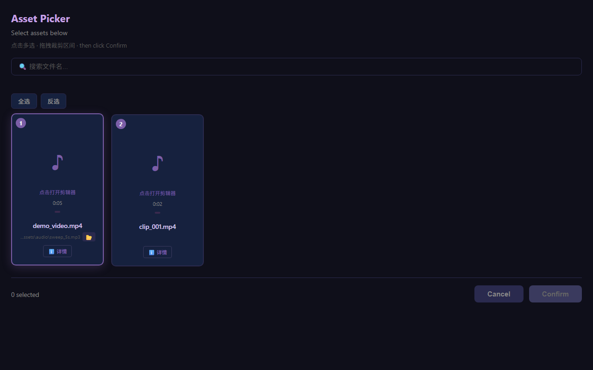
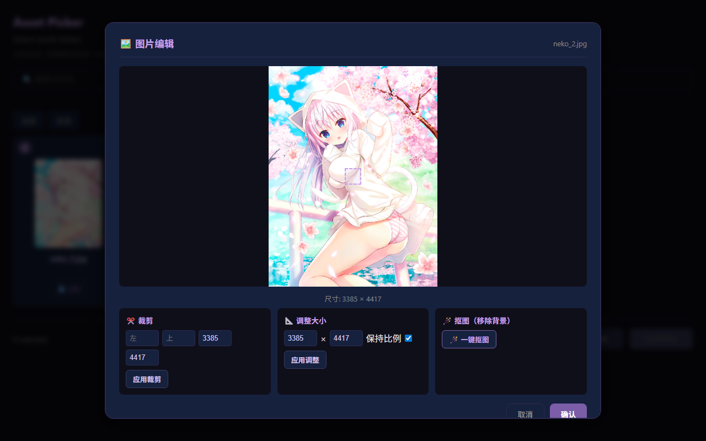
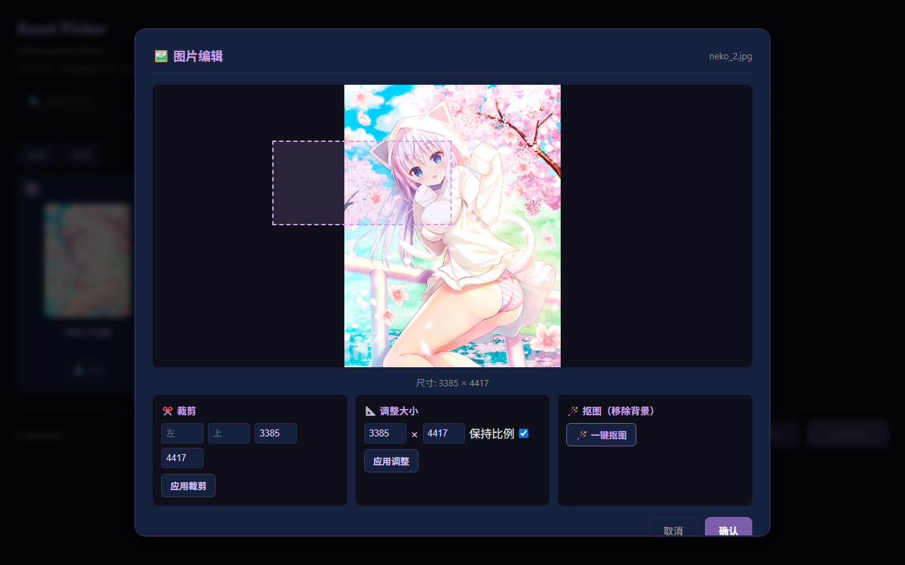

# CLI Helper MCP

为 CLI Agent 补充操作系统交互能力的 MCP Server。

**核心定位**：Agent 在执行任务时，遇到"需要人类看一眼/选一下/确认一下"的节点，临时拉起浏览器或系统对话框完成交互，然后继续执行。所有 GUI 都是**临时弹出的辅助界面**，不是常驻应用。

**演进路线**：HITL (Human-in-the-Loop) → HOTM (Human-on-the-Loop)

---

## 这是什么

- **MCP Server**：注册到 Kimi/Claude 等 Agent 后，Agent 通过工具调用来使用这些能力
- **人机协作框架**：Session 追踪每次交互的完整生命周期，Policy Engine 管控危险操作，Audit Log 记录所有行为
- **GUI 补充层**：当 CLI 无法完成"可视化选择、试听预览、时间轴裁剪"等任务时，临时打开浏览器界面供人类操作

## 这不是什么

| ❌ 不是 | 说明 |
|--------|------|
| 完整的 ffmpeg 可视化工具 | 波形图/时间轴只是辅助 Agent 完成裁剪的临时界面，不做专业音视频编辑 |
| 独立的图片编辑器 | 裁剪/resize/抠图是为 Agent 工作流服务的快捷操作，不做 Photoshop 级别的图像处理 |
| 通用文件管理器 | 文件选择器只在 Agent 需要用户确认文件列表时临时弹出 |
| 桌面应用 | 没有常驻窗口，所有界面都是任务触发后临时拉起，任务结束即关闭 |
| 操作系统替代品 | 不替代 Shell、Finder、Explorer，而是在 Agent 需要人类介入时桥接两者 |
| 操作历史数据库 | Audit Log 和 Timeline 只是人机协作的**可观测性副产品**，用于调试和安全追溯，不做历史管理、不做文件树索引 |

---

## 架构

```
┌─────────┐     stdio MCP     ┌─────────────────────┐
│  Agent  │<─────────────────>│  cli-helper         │
│ (Kimi/  │                   │  ┌────────────────┐ │
│  Claude)│  SSE events       │  │ StdioTransport │ │
│         │<─────────────────│  ├────────────────┤ │
│         │                   │  │ SSETransport   │ │
│         │                   │  ├────────────────┤ │
│         │                   │  │ Express HTTP   │ │
│         │                   │  │  + Web UI      │ │
└─────────┘                   │  └────────────────┘ │
                              └─────────────────────┘
```

- **stdio 模式**：零配置，即插即用，适合本地 CLI Agent
- **SSE 模式**：支持异步、可观测、多客户端，适合远程和 Web UI 联动

---

## MCP 工具

| 工具 | 描述 | 模式 |
|------|------|------|
| `show_dialog` | 同步对话框 (ok/confirm/input/select/file_picker) | 同步 |
| `show_notification` | 非阻塞系统通知 | 即时 |
| `show_asset_picker` | 浏览器资产选择器（图片/音频/视频） | 异步 |
| `upload_files` | 拖拽文件上传 | 异步 |
| `run_command` | 运行 shell 命令 | 同步 |
| `check_process` | 检查进程是否运行 | 同步 |
| `open_path` | 打开文件/文件夹 | 同步 |
| `read_inbox` | 读取用户消息 | 同步 |
| `write_log` | 写入日志 | 同步 |
| `update_state` | 更新状态快照 | 同步 |
| `send_to_agent` | 发送消息给 agent | 同步 |
| `list_sessions` | 列出活跃会话 | SSE |
| `get_session_status` | 查询会话状态 | SSE |
| `abort_session` | 取消进行中的会话 | SSE |
| `manage_policy` | 添加/删除策略规则 | 同步 |
| `list_policies` | 列出所有策略 | 同步 |

---

## 核心概念

### Session

每次交互（tool call）都会创建一个 Session，追踪其完整生命周期：

```
pending → waiting_user → running → completed | cancelled | error | timeout
```

Session 提供可观测性——Agent 和人类都能查询"刚才发生了什么"。

### Policy Engine

策略引擎为 Agent 操作提供规则治理。人类预设规则，Agent 执行时自动评估：

| 动作 | 行为 |
|------|------|
| `allow` | 直接放行 |
| `deny` | 拒绝执行 |
| `confirm` | 弹出系统确认对话框 |
| `notify` | 发送系统通知后执行 |
| `delay` | 延迟 N 秒，期间可在 Dashboard 撤销 |

Scope 支持：`command` | `file` | `tool` | `network`

默认策略（不可删除）：
- `rm -rf /` → deny
- `git push` → confirm
- `npm install` → allow
- `.env` 文件 → confirm

### Choice（Human-in-the-Loop）

当 Agent 需要人类输入时，创建一个 Choice：

1. Agent 调用 tool → 创建 Choice → Promise 等待
2. SSE 广播 `choice-request` → Web UI 展示交互界面
3. 用户操作 → POST `/api/choice/:id` → `resolveChoice()` → Promise resolve
4. Agent 收到结果，继续执行

---

## 环境变量

| 变量 | 默认值 | 说明 |
|------|--------|------|
| `PROJECT_ROOT` | `process.cwd()` | 项目根目录，用于路径解析 |
| `DASHBOARD_PORT` | `7842` | HTTP 服务器端口 |
| `CLI_HELPER_MODE` | `stdio` | 运行模式：`stdio` 或 `sse` |
| `CLI_HELPER_LOG_LEVEL` | `info` | 日志级别 |

---

## REST API

| 方法 | 路径 | 说明 |
|------|------|------|
| GET | `/api/health` | 健康检查 |
| GET | `/api/sessions` | 列出活跃 Session |
| GET | `/api/session/:id/status` | 查询 Session 状态 |
| POST | `/api/session/:id/abort` | 取消 Session |
| POST | `/api/choice/:choiceId` | 响应 Choice |
| GET | `/api/choices/:sessionId` | 列出 Session 的待处理 Choice |
| POST | `/api/cancel-choice/:choiceId` | 取消 Choice |
| GET | `/api/events/:sessionId` | SSE 事件流 |
| GET | `/api/policies` | 列出策略 |
| POST | `/api/policies` | 添加策略 |
| DELETE | `/api/policies/:id` | 删除策略 |
| POST | `/api/policies/evaluate` | 评估策略 |
| GET | `/api/audit` | 查询审计日志 |
| GET | `/api/audit/stats` | 审计统计 |
| GET | `/api/delays` | 列出 pending delay |
| POST | `/api/delay/:id/cancel` | 撤销 delay |
| GET | `/api/timeline` | 全局时间线 |
| GET | `/api/session/:id/timeline` | Session 执行时间线 |
| GET | `/api/session/:id/changes` | Session 文件变更 |
| GET | `/api/notify-configs` | 列出通知配置 |
| POST | `/api/notify-configs` | 添加/更新通知配置 |
| DELETE | `/api/notify-configs/:id` | 删除通知配置 |
| POST | `/api/notify-test` | 发送测试通知 |

---

## Web UI Dashboard

访问 `http://localhost:7842`

功能：
- **Session 列表**：实时显示所有活跃交互
- **事件流 / 时间线切换**：SSE 实时推送 或 Session 执行时间线回放
- **Choice 面板**：响应 Agent 的人工确认请求
- **Policies 标签**：查看/添加/删除策略规则
- **Audit 标签**：查看审计日志和统计
- **Notify 标签**：配置多通道告警（Slack/Webhook/系统通知）
- **Delay 撤销**：事件流中显示倒计时，可一键撤销

通过 URL 参数自动连接：`http://localhost:7842?session=xxx`

---

## 功能截图

浏览器界面只在 Agent 调用工具时**临时弹出**，任务结束后自动关闭。以下截图展示的是人机交互过程中的界面：

### 🖼️ 图片选择器

Agent 需要用户从文件列表中选择时弹出。支持多选、搜索过滤、全选/反选。



### 🎵 音频选择器 + 波形图剪辑器

Agent 需要用户精确选择音频片段时弹出。支持拖拽选择区间、光标定位播放。





### 🔍 搜索过滤

实时按文件名筛选，快速定位目标文件。


### 🎬 视频选择器

Agent 需要用户选择视频并裁剪片段时弹出。支持视频预览播放、时间轴区间选择。



### 🖼️ 图片编辑器

Agent 需要用户确认裁剪/调整大小/抠图时弹出。





---

## 开发

```bash
npm install
npm run build
npm start              # stdio 模式
CLI_HELPER_MODE=sse npm start   # SSE 模式
```

### 脚本

| 脚本 | 说明 |
|------|------|
| `npm run build` | TypeScript 编译 + esbuild 打包 picker.js |
| `npm run start` | 运行编译后的 dist/index.js |
| `npm run dev` | tsx watch 开发模式 |
| `npm run typecheck` | TypeScript 类型检查（不输出文件） |

---

## 目录结构

```
src/
├── index.ts              # 入口：根据 mode 启动 stdio 或 sse
├── server.ts             # Express HTTP + SSE MCP
├── mcp/
│   ├── stdio.ts          # StdioServerTransport（内联于 index.ts）
│   └── tools.ts          # Tool 定义列表（内联于 index.ts）
├── modules/
│   ├── session.ts        # Session 管理（每次 tool call 自动创建）
│   ├── choice.ts         # Choice 框架
│   ├── events.ts         # SSE 广播
│   ├── policy.ts         # 策略引擎
│   ├── audit.ts          # 审计日志
│   ├── delay.ts          # Delay 倒计时
│   ├── timeline.ts       # Session 时间线聚合
│   ├── snapshot.ts       # 文件变更快照
│   └── notify.ts         # 多通道通知告警
├── platform/
│   ├── dialog.ts         # 跨平台对话框
│   └── notification.ts   # 跨平台通知
└── picker/
    ├── picker.ts         # 浏览器端选择器逻辑
    └── types.ts          # 类型定义
public/
└── index.html            # Dashboard Web UI
```
